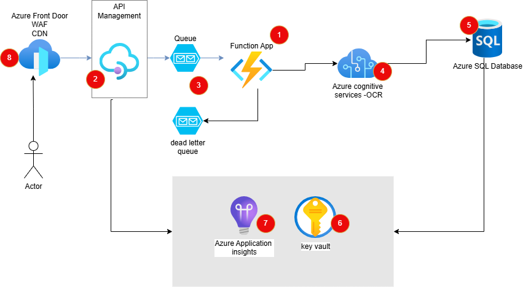

# azure-boletos
Cloud para Desenvolvimento de um serviço responsável por verificar e autenticar boletos bancários, com o objetivo de garantir a validade das informações.

# 1. Azure Functions
Descrição: Utilizar Azure Functions para criar microsserviços sem servidor que serão responsáveis por processar as requisições de verificação e autenticação dos boletos.
Vantagens: Escalabilidade automática, custo baseado no uso e integração fácil com outros serviços da Azure.

# 2. Azure API Management
Descrição: Gerenciar e proteger as APIs expostas pelas Azure Functions.
Vantagens: Controle de acesso, limitação de taxa, monitoramento e análise de uso das APIs.

# 3. Azure Storage Queues e dead letter Queue
Descrição: Utilizar filas para gerenciar as mensagens de forma assíncrona, garantindo que as requisições sejam processadas de forma ordenada e resiliente. As mensagens não processadas vão para dead letter queue
Vantagens: Desacoplamento de componentes, escalabilidade e resiliência.

# 4. Azure Cognitive Services
Descrição: Utilizar o serviço de Visão Computacional para extrair informações dos boletos (OCR) e o serviço de Anomaly Detector para identificar padrões suspeitos.
Vantagens: Processamento avançado de imagens e detecção de fraudes.

# 5. Azure SQL Database
Descrição: Armazenar dados dos boletos processados e resultados das verificações.
Vantagens: Alta disponibilidade, escalabilidade e segurança.

# 6. Azure Key Vault
Descrição: Gerenciar e proteger chaves de criptografia, segredos e certificados utilizados na autenticação e verificação dos boletos.
Vantagens: Segurança centralizada e controle de acesso.

# 7. Azure Application Insights
Descrição: Monitorar o desempenho e a saúde do serviço, coletando logs e métricas.
Vantagens: Diagnóstico e resolução rápida de problemas.

# 8. Azure Front Door
Descrição: Distribuir e proteger o serviço globalmente, garantindo alta disponibilidade e segurança.
Vantagens: Balanceamento de carga global, proteção contra DDoS e SSL/TLS.

Fluxo de Trabalho Atualizado
1. Recebimento do Boleto: O usuário envia o boleto através de uma API gerenciada pelo Azure API Management.
2. Enfileiramento da Requisição: A requisição é enfileirada no Azure Storage Queues.
3. Resposta aod usuario: Boleto sendo processado
4. Processamento Inicial: Uma Azure Function é acionada para processar a mensagem da fila.
5. Extração de Dados: A Azure Function utiliza o Azure Cognitive Services para extrair informações do boleto (OCR).
6. Autenticação: A Azure Function utiliza o Azure Key Vault para acessar chaves do banco de dados.
7. Armazenamento de Resultados: Os resultados são armazenados no Azure SQL Database.
8. Monitoramento: Azure Application Insights monitora todo o processo, coletando métricas e logs.
